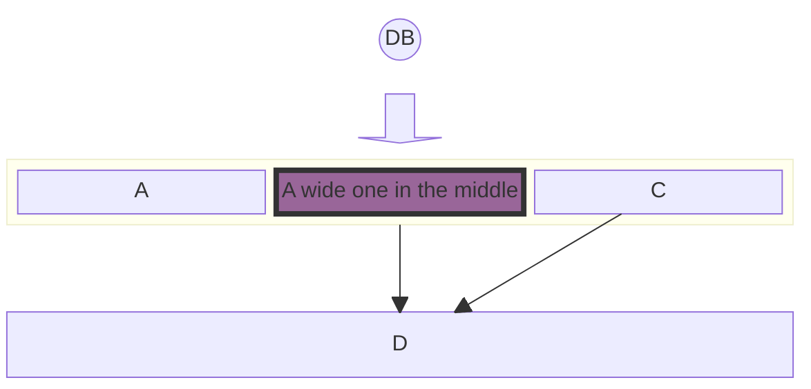
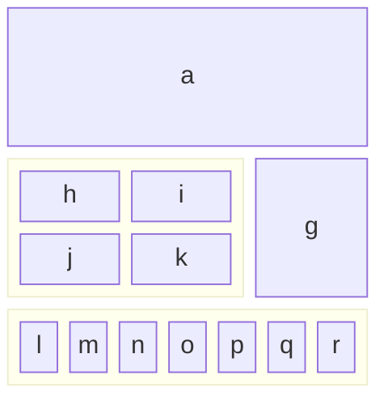
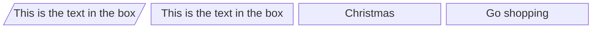
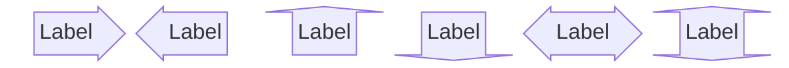
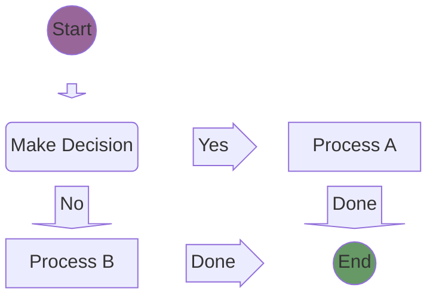
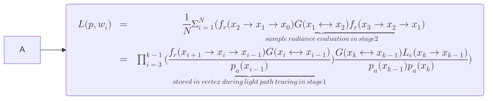
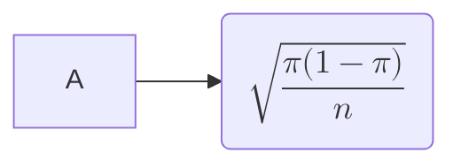

import Tabs from '@theme/Tabs';
import TabItem from '@theme/TabItem';

# Getting Started

Creating an Analog project can be done with minimal steps.

## System Requirements

Analog requires the following Node and Angular versions:

- Node v18.13.0 and higher is recommended
- Angular v15 or higher

## Creating a New Application

To create a new Analog project, you can use the `create-analog` package with your package manager of choice:

<Tabs groupId="package-manager">
  <TabItem value="npm">

```shell
npm create analog@latest
```

  </TabItem>

  <TabItem label="Yarn" value="yarn">

```shell
yarn create analog
```

  </TabItem>

  <TabItem value="pnpm">

```shell
pnpm create analog
```

  </TabItem>
  <TabItem value="bun">

```shell
bun create analog
```

  </TabItem>
</Tabs>

You can also [scaffold a new project with Nx](/docs/integrations/nx).

### Serving the application

To start the development server for the application, run the `start` command.

<Tabs groupId="package-manager">
  <TabItem value="npm">

```shell
npm run start
```

  </TabItem>

  <TabItem label="Yarn" value="yarn">

```shell
yarn start
```

  </TabItem>

  <TabItem value="pnpm">

```shell
pnpm start
```

  </TabItem>
  <TabItem value="bun">

```shell
bun start
```

  </TabItem>
</Tabs>

Visit [http://localhost:5173](http://localhost:5173) in your browser to view the running application.

Next, you can [define additional routes using components](/docs/features/routing/overview) for navigation.

### Building the Application

To build the application for deployment

<Tabs groupId="package-manager">
  <TabItem value="npm">

```shell
npm run build
```

  </TabItem>

  <TabItem label="Yarn" value="yarn">

```shell
yarn build
```

  </TabItem>

  <TabItem value="pnpm">

```shell
pnpm run build
```

  </TabItem>
  <TabItem value="bun">

```shell
bun run build
```

  </TabItem>
</Tabs>

### Build Artifacts

By default, Analog comes with [Server-Side Rendering](/docs/features/server/server-side-rendering) enabled.
Client artifacts are located in the `dist/analog/public` directory.
The server for the API/SSR build artifacts is located in the `dist/analog/server` directory.

## Migrating an Existing Application

You can also migrate an existing Angular application to Analog. See the [migration guide](/docs/guides/migrating) for migration steps.

## Mermaid Examples

### Example 1



### Example 2



### Example 3



### Example 4



### Example 5



### Example 6



### Example 7


